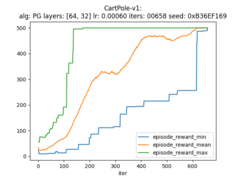
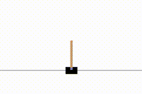
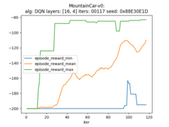
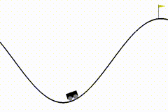
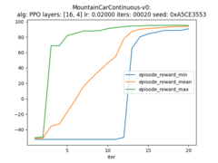
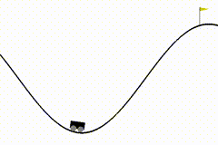
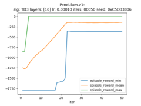

# Exercises with *RLlib*

Exercises with *RLlib* -- an open-source library for reinforcement learning.

Exercises are done using *RLlib* version 1.6.0.

## Table of content

 1. [Project configuration](#project_configuration)
 2. [Solutions](#solutions)
     1. [CartPole-v1](#solution_cartpole)
     2. [MountainCar-v0](#solution_mountaincar)
     3. [MountainCarContinuous-v0](#solution_mountaincarcontinuous)
     4. [Pendulum-v1](#solution_pendulum)
 3. [References](#references)

## Project configuration

Project's configuration can be easily done by execution of `tools/installvenv.sh` script. Script prepares virtual environemtn and installs necessary requirements (`requirements.txt`) inside `venv` subdirectory.

Starting environment can be done by execution of script `venv/activatevenv.sh`. 

## Solutions

### CartPole-v1

Meta parameters:
- algorithm: *Policy Gradients (PG)*
- model: neural network with two fully connected layers of size 64 and 32 respectively
- learning rate: 0.0006
- training steps: 658
- seed: 0xB36EF169

Algorithm took 0:03:15 to train.

Training input config: [input config](doc/solution/classic/cartpole-v1/cartpole-v1-pg.cfg)

Trained agent can be found [here](doc/solution/classic/cartpole-v1/cartpole-v1-pg-agent.zip)

Run command: `./src/rllibexercises/classic/cartpole_pg.py --seed=0xB36EF169`

### MountainCar-v0

Meta parameters:
- algorithm: *Deep Q Networks (DQN)*
- model: neural network with two fully connected layers of size 16 and 4 respectively
- learning rate: 0.0005
- training steps: 117
- seed: 0x88E30E1D

Algorithm took 0:06:09 to train.

Training input config: [input config](doc/solution/classic/mountaincar-v0/mountaincar-v0-dqn.cfg)

Trained agent can be found [here](doc/solution/classic/mountaincar-v0/mountaincar-v0-dqn-agent.zip)

Run command: `./src/rllibexercises/classic/mountaincar_dqn.py --seed=0x88E30E1D`

### MountainCarContinuous-v0

Meta parameters:
- algorithm: *Proximal Policy Optimization (PPO)*
- model: neural network with two fully connected layers of size 16 and 4 respectively
- learning rate: 0.02
- training steps: 20
- seed: 0xA5CE3553

Algorithm took 0:02:07 to train.

Training input config: [input config](doc/solution/classic/mountaincarcontinuous-v0/mountaincarcontinuous-v0-ppo.cfg)

Trained agent can be found [here](doc/solution/classic/mountaincarcontinuous-v0/mountaincarcontinuous-v0-ppo-agent.zip)

Run command: `./src/rllibexercises/classic/mountaincarcontinuous_ppo.py --seed=0xA5CE3553`

### Pendulum-v1

Meta parameters:
- algorithm: *Twin Delayed DDPG (TD3)*
- model: neural network with fully connected layer of size 16
- learning rate: 0.0001
- training steps: 20
- seed: 0xC5D33806

Algorithm took 0:15:01 to train.

Training input config: [input config](doc/solution/classic/pendulum-v1/pendulum-v1-td3.cfg)

Trained agent can be found [here](doc/solution/classic/pendulum-v1/pendulum-v1-td3-agent.zip)

Run command: `./src/rllibexercises/classic/pendulum_td3.py --seed=0xC5D33806`

## References:

- RLlib master (https://docs.ray.io/en/master/rllib/index.html)
- RLlib stable (https://docs.ray.io/en/stable/rllib.html)
- RLlib source code (https://github.com/ray-project/ray/tree/master/rllib)
- Gym environments (https://gym.openai.com/envs/)
- Review of popular reinforcement learning libraries (https://neptune.ai/blog/the-best-tools-for-reinforcement-learning-in-python)
